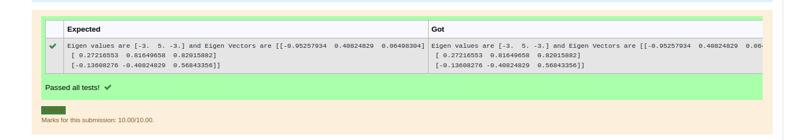

# EIGENVALUES-AND-EIGENVECTORS
## Aim:
To write a python program to find the Eigenvalues and Eigen Vectors
## Equipment’s required:
1. 	Hardware – PCs
2. 	Anaconda – Python 3.7 Installation / Moodle-Code Runner
## Algorithm:
### Step1 : 
Import the numpy module to use the builtin function for calculation.
### Step 2: 
Prepare the list from linear equation and assign in np.array().
### Step 3: 
Using the np.linalg.eig(),  we get two results (first is eigenvalue and second is eigenvector) of the given matrix.
### Step 4: 
End of the program.

## Program:
```python


import numpy as np
a= np.array([[2,2],[1,3]])
values,vectors=np.linalg.eig(a)
print('Eigen values are {} and Eigen Vectors are {}'.format(values,vectors))
```


## Output:

## Result:
Thus the Eigenvalue and Eigenvector is successfully solved using python program
